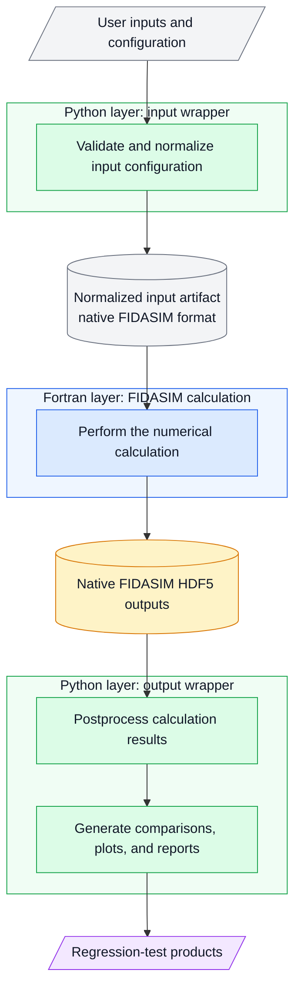
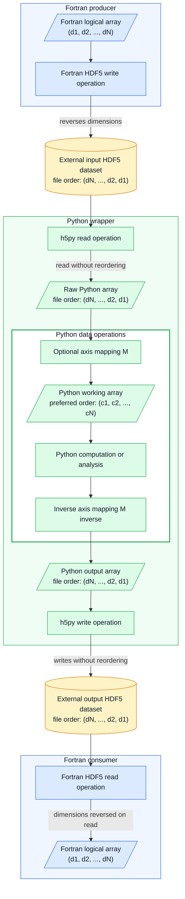

# FIDASIM regression tests

This directory contains reproducible workflows for checking selected FIDASIM
calculations against trusted reference data. A regression test may generate or
store its reference data, run the implementation under test, and compare the
result in separate stages.

## Available tests

| Test | Purpose | Documentation |
| --- | --- | --- |
| `test_001` | Beam attenuation regression workflow. | [Test 001 portal](test_001/README.md) |
| `test_002` | Conversion of CQL3D velocity-space distributions into the FIDASIM energy-pitch representation. | [Test 002 portal](test_002/README.md) |
| `test_003` | Two-dimensional inverse-transform sampling of fast-ion energy-pitch distributions. | [Test 003 portal](test_003/README.md) |
| `test_004` | Charge-exchange ion-sink rate and energy-pitch distribution. | [Test 004 portal](test_004/README.md) |

## Python–Fortran workflow and HDF5 array ordering

The regression tests place the compiled FIDASIM calculation between Python
input and output layers:



The core HDF5 library uses the C array convention, in which the last index
varies fastest. Fortran uses column-major arrays, in which the first index
varies fastest. The HDF5 Fortran interface reconciles these conventions by
reversing the dimension order when a Fortran program writes an array.

The Fortran interface applies the reverse conversion when another Fortran
program reads the dataset. A Fortran-to-Fortran exchange therefore preserves
the expected logical array order:

```text
Fortran array:  A(d1, d2, ..., dN)
HDF5 file:      A(dN, ..., d2, d1)
Fortran array:  A(d1, d2, ..., dN)
```

HDFView and h5py instead expose the dimension order recorded in the HDF5 file.
They do not apply the Fortran conversion. Consequently,

```text
Fortran: A(i, j, k)
HDFView: A(k, j, i)
h5py:    raw[k, j, i]
```

The FIDASIM charge-exchange table provides a concrete example. Its Fortran
writer defines

```fortran
dim3 = [n_max, m_max, nenergy]
```

and writes `cx(initial level, final level, relative energy)`. For
`n_max = 12`, `m_max = 12`, and `nenergy = 200`, HDFView reports the dataset
shape `(200, 12, 12)`, and h5py exposes

```text
cx[relative energy, final level, initial level]
```

The values are not corrupted; only their indexing convention changes. Because
the two level axes both have length 12, their physical meanings must come from
the Fortran writer rather than from the dataset shape alone.

### The Fortran–Python–Fortran round-trip rule

When Python sits between a Fortran producer and a Fortran consumer, the array
passed to the h5py writer must use the HDF5 file order that the Fortran reader
will convert into the consumer's required logical order:

- If Python keeps the raw h5py axis order, it should write that array back
  without reordering it.
- If Python reorders the raw array into a preferred working order, it
  must apply the inverse mapping before calling the h5py writer.

In the diagram, `M` maps the h5py file order into the preferred Python working
order `(c1, c2, ..., cN)`. `M inverse` restores the file order. Both are
identity operations when Python works directly in h5py order.

Rectangles in the diagram represent operations, parallelograms represent
in-memory arrays, cylinders represent external HDF5 datasets, and labelled
regions identify the program responsible for each operation. Blue identifies
Fortran code, green identifies the Python wrapper, and amber identifies
external HDF5 storage. The nested region inside the Python wrapper separates
data operations from the h5py input/output interface.

The complete interface is therefore



For each exchanged dataset, document the Fortran logical order, h5py file
order, and Python working order. Validate the raw rank and dimensions, and
keep `M` and `M inverse` at the Python input and output boundaries. Use
explicit operations such as `transpose` or `swapaxes`, with comments naming
the semantic axes. Python-only outputs may remain in the preferred Python
order because they are not consumed by a Fortran HDF5 reader.

## Build

FIDASIM uses a hierarchy of makefiles controlled by the repository-level
makefile. The platform environment scripts replace the earlier FIDASIM
installation practice of defining compiler and library settings in the user's
`.bashrc`. Keeping these settings in an explicit, repository-local script
makes the build configuration visible, reproducible, and portable between
users and systems.

Configure and source the appropriate platform environment file in each new
build shell before starting the build:

```bash
cd "$FIDASIM_DIR"
# Inspect and configure the selected file before sourcing it.
source env/<platform>.sh
make
```

The script must be sourced rather than executed so that its exported variables
remain available in the current shell when `make` is invoked.

The environment file selects the compilers and one of two HDF5 build paths:

| `USE_SYSTEM_HDF5` | HDF5 path |
| --- | --- |
| `0` | Build and use the bundled HDF5 installation under `deps/hdf5`. |
| `1` | Use an existing HDF5 installation described by `HDF5_INCLUDE`, `HDF5_LIB`, and, when needed, `HDF5_EXTRA_LIBS`. |

The bundled HDF5 version is a legacy dependency and can fail to build with
newer compilers. Configure `USE_SYSTEM_HDF5=1` and valid system HDF5 paths on
affected platforms. See the [environment setup](../env/Readme.md) and
[historical build notes](../env/Historial_note.md) for the platform-specific
configuration.

Sourcing the environment file exports the selected values before Make starts.
Assignments using `?=` supply defaults only when a value has not already been
defined, so they preserve the environment selection. The repository-level
makefile then constructs and exports the compiler, module-path, and linker
settings consumed by the makefiles below it.

The HDF5 selection changes the prerequisites of the repository-level
`fidasim` target:

```text
configure and source env/<platform>.sh
                    │
       repository makefile: fidasim
                    │
       ┌────────────┴────────────┐
       │                         │
USE_SYSTEM_HDF5=0        USE_SYSTEM_HDF5=1
       │                         │
add the deps target        omit the deps target
       │                         │
build and use              use HDF5_INCLUDE,
deps/hdf5                  HDF5_LIB, and
                           HDF5_EXTRA_LIBS
```

After applying that conditional selection, the repository-level makefile
requests the following build targets:

```text
repository target: fidasim
├── deps                         [bundled-HDF5 builds only]
├── src
├── tables                       [depends on src]
├── python
└── regression_tests             [depends on src]
    ├── test_001
    ├── test_003
    └── test_004
```

The branches under `fidasim` are targets requested by the repository-level
makefile; they do not mean that one sibling invokes the next. The explicit
dependency labels mean that `tables` and `regression_tests` wait for `src`.
The `src` makefile builds only the FIDASIM objects and executable. The
repository-level `python` target independently creates the configured Python
executable link.

Test 002 consists of Python workflows and therefore has no compiled target in
the regression-test makefile.

After the complete build has established the selected HDF5 infrastructure and
FIDASIM objects, the regression programs can be rebuilt from the repository
root with:

```bash
make regression_tests
```

This target invokes the `src` submake first, so changed FIDASIM sources are
rebuilt before the regression programs. It does not invoke `deps`, and
therefore assumes that the selected HDF5 installation is already available.

Run instructions and dependencies specific to each test are documented in its
portal or stage README.

### Known build-system limitations

The graph above describes the intended build order. The following issues remain
to be corrected:

- In a bundled-HDF5 build, `deps` and `src` are separate prerequisites of the
  top-level target; `src` does not explicitly depend on `deps`. A parallel
  clean build can therefore start compiling FIDASIM before the bundled HDF5
  module files and libraries have been created.
- Recursive recipes currently invoke `make` after changing directories. Using
  `$(MAKE) -C <directory>` would preserve GNU Make's recursive-build and
  parallel-job coordination more reliably.

Until the bundled dependency ordering is corrected, use the full non-parallel
repository build when creating the bundled HDF5 installation from a clean
checkout.
